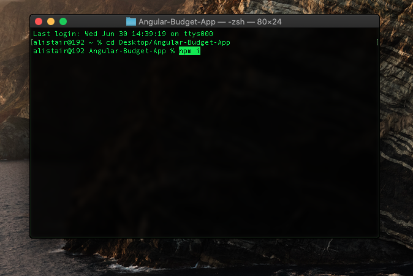

# Angular Budget App

## Table of Contents:

- [About](#about)
- [Installation](#installation)
- [Features](#features)
- [Technologies](#technologies)
- [Improvements](#improvements)

## About

- This is a simple and easy to use budgeting app written with Typescript in Angular.js, it allows the user to input their expenses as well as update and delete them, additionally the user can see which expenses are costing them more than they'd like and adjust them accordingly.

## Installation

- ** This is very important ** You will be required to have Node.js, along with Angular.js installed on your computer in order to run this application locally.

### **If you already have the Angular CLI tool and Node.js installed on your device already, you can go ahead and ignore the next couple steps.**

### Step 1 - Installing Node.js

- You will need to start by installing node.js, please visit https://nodejs.org/en/ to install the recommended version of node.js, pay attention to which operating system you have so you install the correct one.
- Once you have Node.js installed on your device, open up your terminal and type `node -v` and press enter. If a version comes up, congratulations you have successfully installed Node. If you are running into errors however, you can checkout this video on how to correctly install node: https://www.youtube.com/watch?v=JINE4D0Syqw

### Step 2 - Installing The Angular.js CLI

- Now it is time to install Angular.js on your device. To install Angular, simply open up your terminal and type `npm install -g @angular/cli`.
- Once installed, verify whether or not you have done this correctly by typing `ng --version` in the same terminal window and hit enter. If a version comes up you're all set to run the app!

### Running the application

- First start by cloning this project to your computer, you can visit this link for more details on cloning a project if you are unfamiliar with the process:
https://docs.github.com/en/github/creating-cloning-and-archiving-repositories/cloning-a-repository-from-github/cloning-a-repository.

- Once you have the project downloaded, open a new terminal, you can search for command prompt on a Windows PC or search for terminal on macOS like so...

- Use the cd command to navigate to the downloaded folder. For instance, if you downloaded the folder to your Desktop, you'd type `cd Desktop/Angular-Budget-App` from the root directory of your computer, it will be different if you downloaded the project to your Documents or Downloads folder and so on.

- Once you are in the Angular-Budget-App directory, simply type `npm i` to install all of the dependencies required for this app to run, this could take a minute or two depending on your internet speed.

- Once all of the dependencies are successfully installed, type `ng serve` and press enter. This will start the server locally for you.

- Once the terminal says it has compiled successfully, open your web browser and go to http://localhost:4200. You should now be able to see/use the finished Budget Application, take a moment to try all of the features out and see how you like it!

## Features

- Simple and elegant looking user interface
- Easily add and update expenses
- See which expenses are costing you more than you'd like by being highlighted in red
- Easily delete unwanted expenses

## Technologies

- Angular.js

## Improvements

As a developer I always strive to make my applications better as well as more full featured and this one is no exception, some nice improvements I have in mind are:

- The use of the Local Storage API built into the browser or some kind of database such as Firebase to save data persistently.
- The ability to log in/sign up so the expenses are tied to a specific individual, this way many different people can use the app.
- General UI/UX improvements and more responsiveness to make the app more phone/tablet friendly.
- The use of modals for alerting the user rather than relying on the built in browser `alert()` method.
